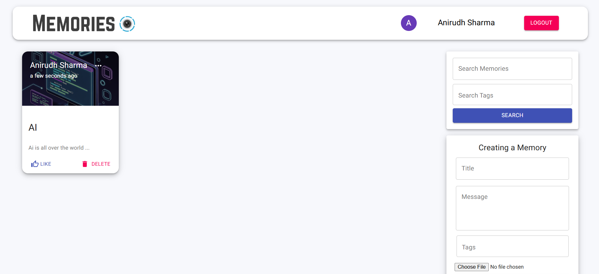
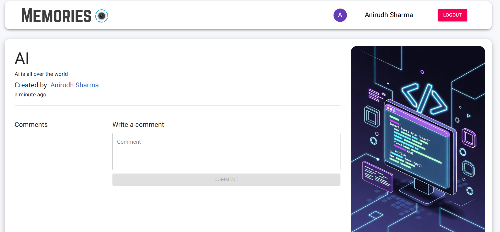
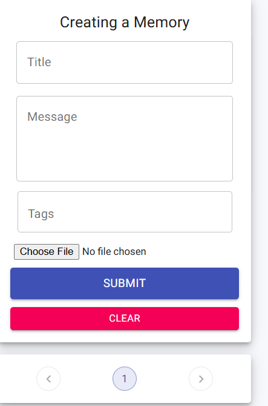

# 🧠 Memories App — Frontend (React + Redux)
[Live Demo](https://memories-frontend1.netlify.app/)
## 🌟 Features

### 📝 Memories Management
- Create, edit, delete memories
- View detailed memory pages
- Recommended related memories

### 💬 Comments System
- Add comments to memories
- Scrollable comment section
- Auto-scroll to latest comment
- Conditional rendering for authenticated users
- Real-time UI update after posting comment

### ❤️ Optimized Likes System
- Instant UI feedback on like/unlike
- Async backend synchronization
- Optimistic UI updates

### 🔎 Search & Pagination
- Search memories by:
  - Title
  - Tags
- URL-based filtering
- Server-side pagination

### 🔐 Authentication UI
- Login/Signup support
- Protected actions for authenticated users
- User session persistence using localStorage

### ⚡ UX Enhancements
- Loading indicators
- Responsive design
- Material UI components
- Modern clean UI

---

## 🧰 Tech Stack

- React.js
- Redux 
- React Router DOM
- Material UI
- Axios
- CSS-in-JS Styling

---
next-goal
-Implement CI/CD pipeline
-Deployment to Aws
